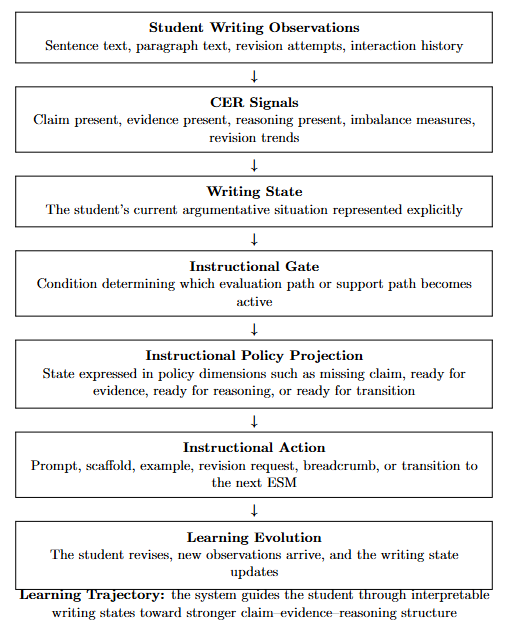

# Digital Learning Companion (DLC)

Deterministic learning systems for writing and reasoning.

The **Digital Learning Companion (DLC)** is a reference implementation of the **Emergent State Machine (ESM)** architecture applied to education.

It demonstrates how instructional AI systems can provide structured guidance while keeping reasoning and instructional policy transparent and inspectable.

---

## System Architecture

The DLC uses a two-component **Bird–Brain architecture** built on the Emergent State Machine.
```
Student Writing
      │
      ▼
dlc_web  (Phoenix LiveView UI)
      │
      ▼
dlc_brain  (Deterministic policy engine)
      │
      ▼
Emergent State Machine reasoning loop
      │
      ▼
Deterministic instructional guidance
```

This architecture separates:

• interaction — handled by the Bird (UI)
• reasoning — handled by the Brain (policy engine)
• instructional structure — defined by the Emergent State Machine

This separation allows learning systems to remain deterministic, auditable, and inspectable.


System Components
dlc_web — "Bird"

Phoenix LiveView interface responsible for:

• student interaction
• writing workspace
• telemetry visualization
• instructional messaging

dlc_brain — "Brain"

FastAPI deterministic reasoning and policy engine responsible for:

• signal extraction
• writing state construction
• instructional gating
• policy projection
• deterministic guidance generation

The Brain implements the instructional reasoning loop defined by the Emergent State Machine.

---

# The ESM Learning Loop

The DLC implements the full instructional reasoning loop defined by the Emergent State Machine architecture:

Observation  
→ Signal extraction  
→ Writing state construction  
→ Instructional gate  
→ Policy projection  
→ Instructional action  
→ Learning evolution

This allows the system to guide students through interpretable writing states rather than producing opaque feedback.

---

# CER Writing Example

The current MVP focuses on argumentative writing structure.

The system tracks the development of:

• Claim  
• Evidence  
• Reasoning  

and delivers deterministic instructional scaffolding as students revise their work.

<p align="center">
  
</p>


---

# Repository Structure

```
dlc
├── dlc_brain
└── dlc_web
```


Both components are included as submodules.

---

# Quickstart

Clone the meta repository with submodules:


git clone --recurse-submodules https://github.com/Digital-Learning-Companion/dlc.git

cd dlc


Run the deterministic policy engine:


cd dlc_brain
PYTHONPATH=. python -m uvicorn dlc.app:app --port 8000


Run the Phoenix interface:


cd dlc_web
mix phx.server


---

# Architecture Context

The DLC sits within the broader architecture ecosystem:

Emergent State Machine  
https://github.com/emergent-state-machine/esm-spec

Controlled Mutation Layer  
https://github.com/controlled-mutation-layer

---

# Status

MVP writing tutor operational.

The system demonstrates deterministic instructional feedback for structured writing tasks.

